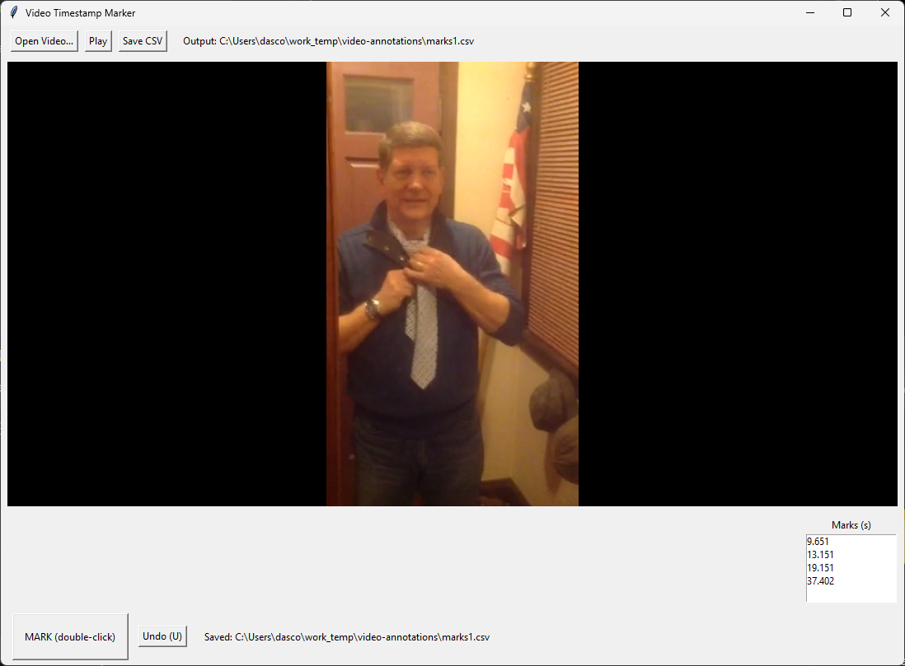

# video-annotator

## Intro



Functions
- Double-click the big “MARK (double-click)” button to record an event.
- Or press M to mark (faster for many users).
- Space toggles play/pause.
- U undoes last mark.
- S saves to CSV anytime (it also auto-saves on quit).

Notes
- Precision: VLC gives current time in milliseconds; we write seconds with millisecond precision (#.###).
- Double-click vs hotkey: The big button only registers a double-click (single clicks are ignored). Many participants prefer the M key—less cursor movement, fewer misses.
- Debounce: Default 250 ms between marks to avoid accidental duplicates; change with --mingap.
- Single-column CSV: Exactly timestamp_seconds. If later you want to separate “Group A/B,” run two passes (or change the script to add a dropdown and a second column).
- Undo: Press U to remove the last mark.
- Auto-save: On quit, it saves to the --out CSV.

# Development Guide

## Setup

1. Install VLC (the desktop app):

- macOS: install via dmg or brew install --cask vlc
- Windows: install from videolan.org
- Linux: your package manager (apt install vlc, etc.)

2. Install Python deps:

- python -m venv .venv
- pip install -r requirements.txt

## Run and Annotate

```shell
python video_mark.py --video /path/to/video.mp4 --out marks.csv
```

## Build executable
~9 MB

Option A (install VLC prior)
```shell
pyinstaller -F -n VideoMarker --icon .\docs\video_mark_icon.ico .\app\video_mark.py
```
Note: Users must have VLC installed (matching 64-bit vs 32-bit).


Option B (VLC bundled in)
```shell
pyinstaller -F -n VideoMarker --icon .\docs\video_mark_icon.ico --add-binary "C:\Program Files\VideoLAN\VLC\libvlc.dll;." --add-binary "C:\Program Files\VideoLAN\VLC\libvlccore.dll;." --add-data "C:\Program Files\VideoLAN\VLC\plugins;vlc_plugins" ./app/video_mark.py
```
~65 MB


