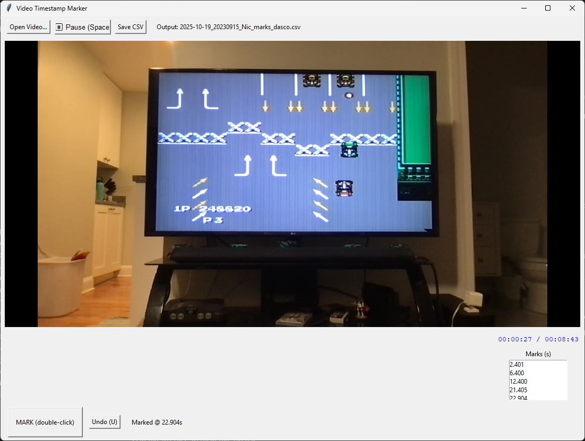
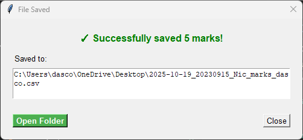

# video-annotator

## Intro

Mark Window


Functions
- Space toggles play/pause.
- M or Double-click the big “MARK (double-click)” button to mark an event.
- U undoes last mark.
- S saves to CSV anytime (it also auto-saves on quit).

Notes
- Precision: VLC gives current time in milliseconds; we write seconds with millisecond precision (#.###).
- Double-click vs hotkey: The big button only registers a double-click (single clicks are ignored). Many participants prefer the M key—less cursor movement, fewer misses.
- Debounce: Default 250 ms between marks to avoid accidental duplicates

Save Window


# Development Guide

## Setup

1. Install VLC (the desktop app):

- macOS: install via dmg or brew install --cask vlc
- Windows: install from videolan.org
- Linux: your package manager (apt install vlc, etc.)

2. Install Python deps:

- python -m venv .venv
- pip install -r requirements.txt

## Run and Annotate

```shell
python video_mark.py --video /path/to/video.mp4 --out marks.csv
```

## Build executable

### Windows
~9 MB

Option A (install VLC prior)
```shell
pyinstaller -F -n VideoMarker --icon .\docs\video_mark_icon.ico .\app\video_mark.py
```
Note: Users must have VLC installed (matching 64-bit vs 32-bit).

Option B (VLC bundled in)
```shell
pyinstaller -F -n VideoMarker --icon "./docs/video_mark_icon.ico" --add-binary "C:\Program Files\VideoLAN\VLC\libvlc.dll;." --add-binary "C:\Program Files\VideoLAN\VLC\libvlccore.dll;." --add-data "C:\Program Files\VideoLAN\VLC\plugins;vlc_plugins" ./app/video_mark.py
```
~65 MB

### macOS
~15 MB

**Quick build (recommended):**
```shell
# Build without VLC bundled (requires VLC on target system)
./build_macos.sh

# Build with VLC bundled (larger but self-contained)
./build_macos.sh --bundle-vlc
```

**Manual build:**

Option A (install VLC prior)
```shell
pyinstaller -F -n VideoMarker --icon ./docs/video_mark_icon.ico ./app/video_mark.py
```
Note: Users must have VLC installed via Homebrew or from videolan.org.

Option B (VLC bundled in)
```shell
# First, find VLC installation path (adjust if VLC is installed elsewhere)
VLC_PATH="/Applications/VLC.app/Contents/MacOS/lib"
pyinstaller -F -n VideoMarker --icon ./docs/video_mark_icon.ico \
  --add-binary "$VLC_PATH/libvlc.dylib:." \
  --add-binary "$VLC_PATH/libvlccore.dylib:." \
  --add-data "$VLC_PATH/../plugins:vlc_plugins" \
  ./app/video_mark.py
```
~80 MB

**Code signing (for distribution):**
```shell
codesign --force --deep --sign "Developer ID Application: Your Name" dist/VideoMarker
```


